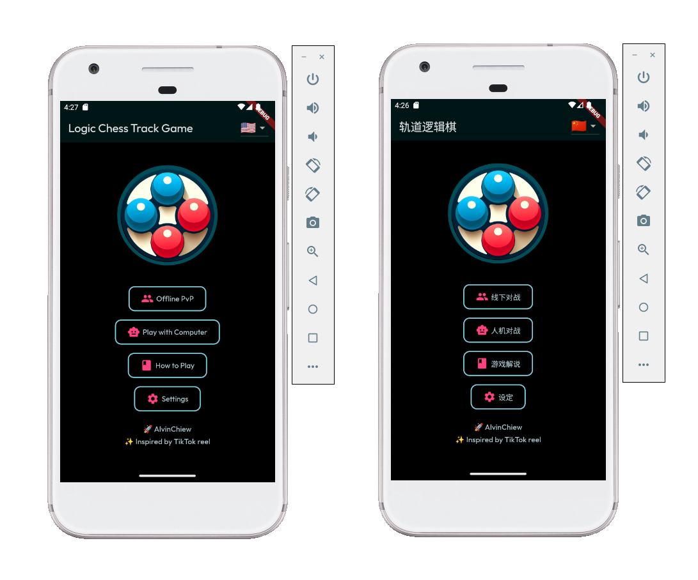

# Logic Chess Track Game | 轨道逻辑棋

- Download: [here](https://github.com/AlvinChiew/logic-chess-track-game/raw/refs/heads/main/logic_chess_track_game_v1.0.0.apk)
- Youtube Demo: [link](https://www.youtube.com/watch?v=mnRPmoSrgTw)

A fun and simple orbital logic board game inspired by gameplay in TikTok! The game logic is designed to test and train IQ through spatial reasoning and pattern recognition. Will be released to Android Play Store (potentially other platforms, e.g. Apple Store, Desktop, Website) soon!

## TODO

1. Upgrade AI Bot
1. Online 1v1 (leaderboard)

## Demo

https://github.com/user-attachments/assets/8fa3edbc-7f41-46e2-9c80-0c2d83d6c64b

## Interface

Home Screen (English, Chinese)

## LICENSE

Copyright (C) Alvin Chiew - All Rights Reserved

Unauthorized usage of this software and associated documentation files (the "Software") including the rights to use, copy, modify, merge, publish, distribute, sublicense, and/or sell copies of the Software, via any medium, is strictly prohibited. The above copyright notice and this permission notice shall be included in all copies or substantial portions of the Software.

Proprietary and confidential.

THE SOFTWARE IS PROVIDED "AS IS", WITHOUT WARRANTY OF ANY KIND, EXPRESS OR
IMPLIED, INCLUDING BUT NOT LIMITED TO THE WARRANTIES OF MERCHANTABILITY,
FITNESS FOR A PARTICULAR PURPOSE AND NONINFRINGEMENT. IN NO EVENT SHALL THE
AUTHORS OR COPYRIGHT HOLDERS BE LIABLE FOR ANY CLAIM, DAMAGES OR OTHER
LIABILITY, WHETHER IN AN ACTION OF CONTRACT, TORT OR OTHERWISE, ARISING FROM,
OUT OF OR IN CONNECTION WITH THE SOFTWARE OR THE USE OR OTHER DEALINGS IN
THE SOFTWARE.
